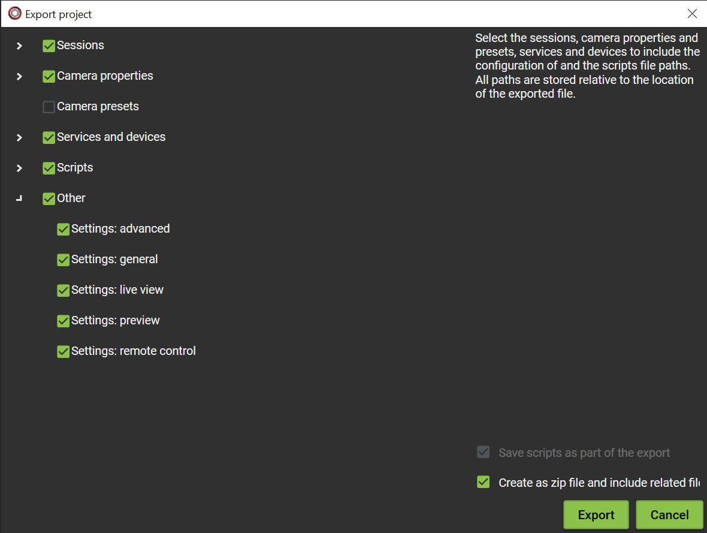
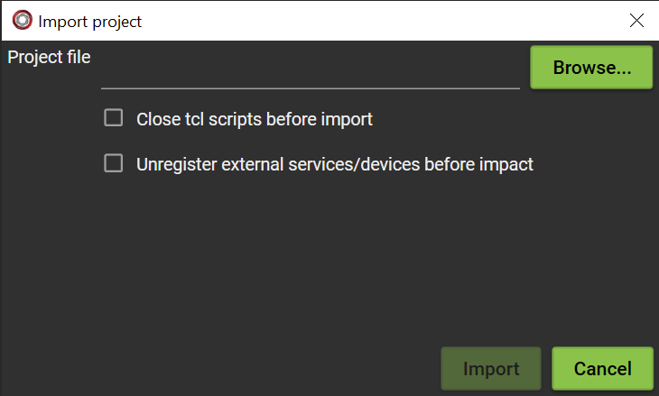
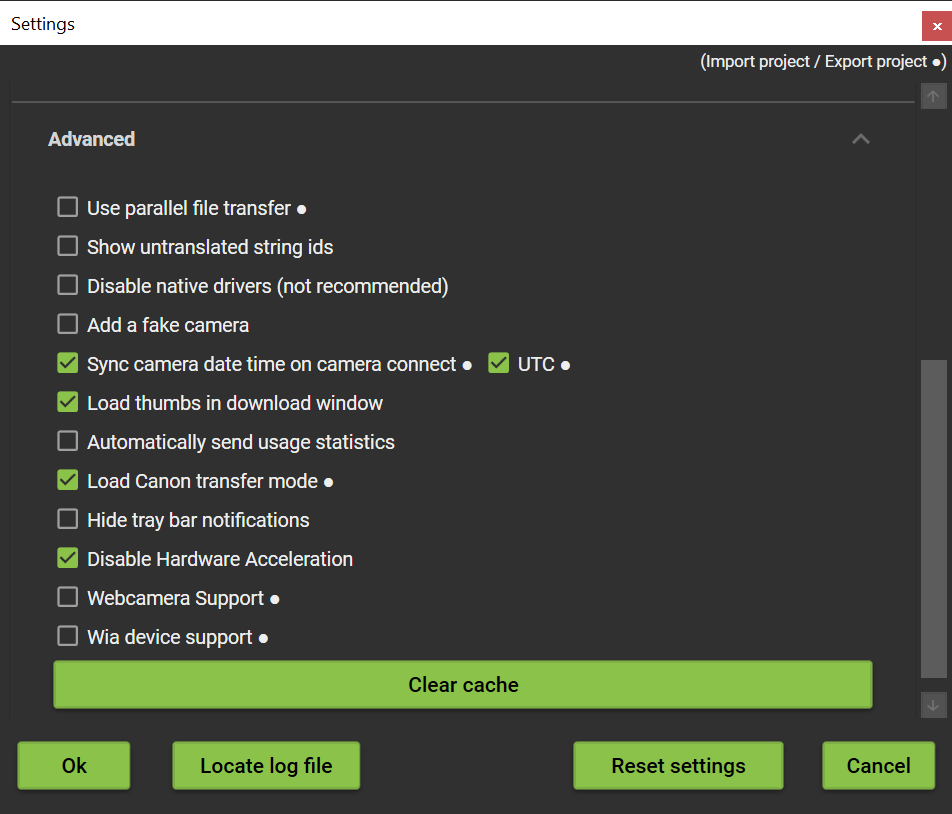
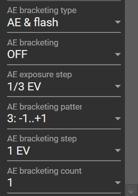
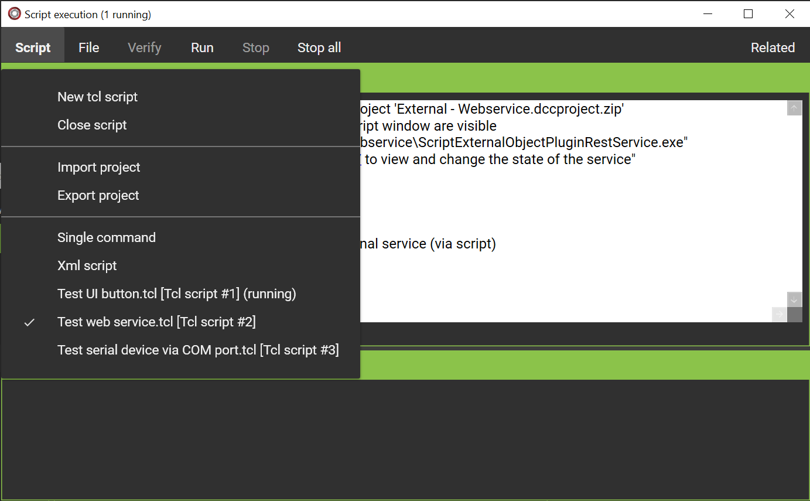
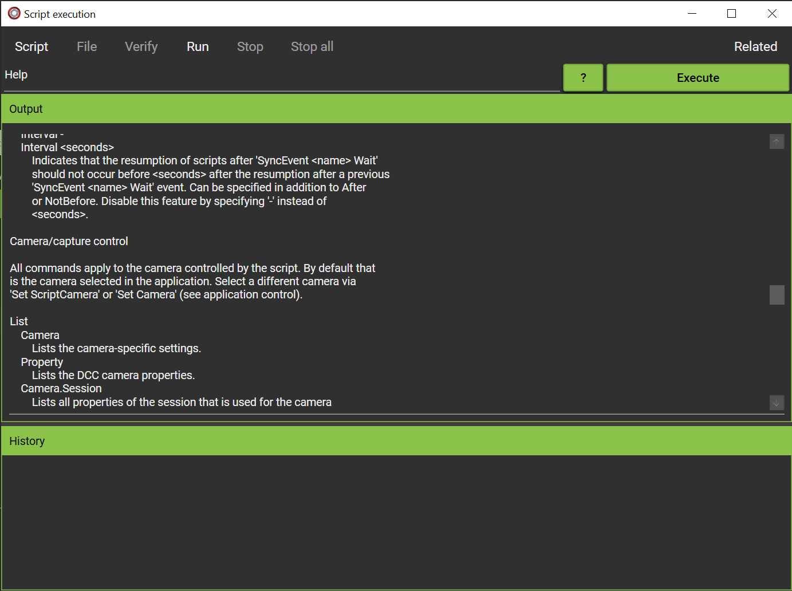
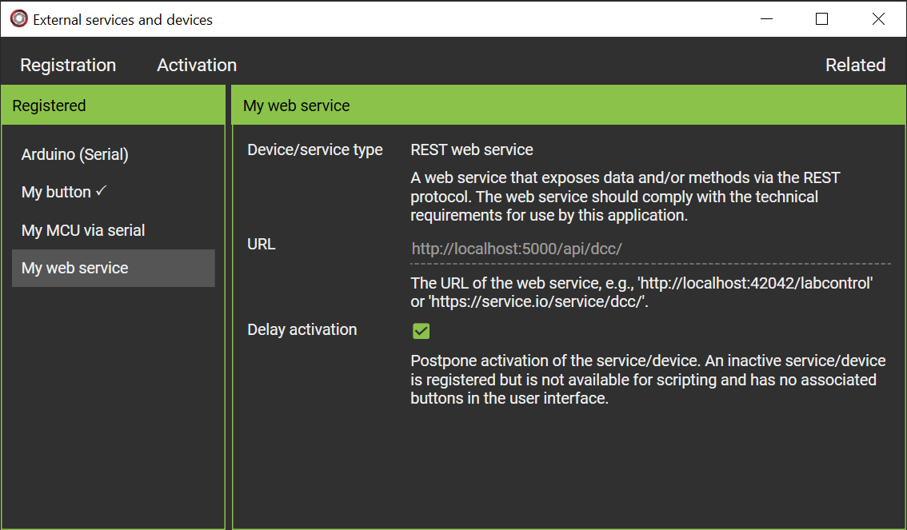
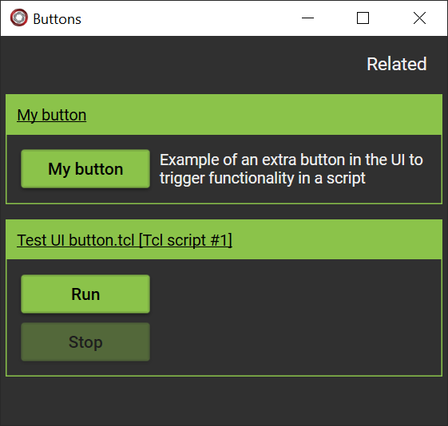

# Frank's Fork of digiCamControl

[digiCamControl](http://digicamcontrol.com/) is DSLR camera remote control open source software.
Frank's Fork was created from the [digiCamControl code](https://github.com/dukus/digiCamControl) version 2.1.7.

The fork has extra features and is backward compatible with the official digiCamControl version.
The extra features are offered as PRs to digiCamControl. If all PRs are accepted, the fork will cease to exist.

Download and install the [setup](https://github.com/frobijn/digiCamControl/releases/download/2.2.0.0/digiCamControlsetup_2.2.0.0.msi) labelled digiCamControl 2.2.0.0 to experiment with the new features.

## Additional features

- DCC project files to exchange settings/configurations/scripts between PCs ([PR](https://github.com/dukus/digiCamControl/pull/434)).
- In-camera bracketing support for Nikon cameras ([PR](https://github.com/dukus/digiCamControl/pull/427)).
- Camera date/time synchronization using UTC ([PR](https://github.com/dukus/digiCamControl/pull/429)).
- Multiple cameras can be controlled independently by separate Tcl scripts ([PR](https://github.com/dukus/digiCamControl/pull/431)).
- digiCamControl can communicate with external services that are not plugins ([PR](https://github.com/dukus/digiCamControl/pull/434)).

### DCC project files

It is now much easier to transfer selected application settings, camera settings, scripts and configurations of services
and plugins (if they support that) between PC.

### In-camera bracketing support for Nikon cameras

digiCamControl supports bracketing, but then every picture is an individual capture in the application. That is relatively slow, about a second per image. In-camera bracketing is much faster. There are situations where that is required. E.g., if the target is moving (but not so fast). Or as part of a time lapse of a solar eclipse in the totality phase, where you need many images (7 - 9) for a HDR to capture the outer regions of the corona, but the totality may be quite short (1-2 minutes) so it is a challenge to collect sufficient HDR images for a smooth video.

The in-camera AE bracketing properties are now available for Nikon cameras. In digiCamControl the bracketing can be configured. Also set the properties for continuous shooting and set the burst rate to the number of images in the bracket. If capture is started in digiCamControl, the camera then takes all images as fast as possible before control is returned to digiCamControl.
		

### Camera date/time synchronization using UTC

The time a picture is taken is available from the EXIF information. Unfortunately no time zone is registered, even if the camera internally supports time zones. For EXIF it uses what is configured as local time. If your travel takes you to various time zones the post-processing software may get confused. That's why I set the camera's time zone to UTC or Greenwich time and no daylight savings time; the EXIF timestamp is UTC independent of where the picture was taken.

With this feature digiCamControl can be set up to also use UTC when synchronizing the camera's clock with the one of the PC. The accuracy of the synchronization is also improved.

### Multiple cameras can be controlled by independently by separate Tcl scripts

In the user interface of digiCamControl multiple cameras can be controlled at the same time. That is: the application offers a way to have multiple cameras connected, show multiple live views, and capture images by each of the cameras with a single click. But that is not always sufficient.

Sometimes the application should control multiple cameras that operate independently from each other. E.g., if multiple cameras are used for photographing solar eclipses (time lapses), each camera my have its own time lapse interval and camera properties. A camera with telephoto lens may use bracketing and take a lot of images with a short interval and only during totality, while a camera with wide angle lens may start minutes earlier to capture the sky's darkening and have a longer interval.

This is now possible via tcl scripting. Multiple tcl scripts can run in parallel, each controlling a single camera. If one script stops because of a problem with the camera, the other scripts continue. It is possible to synchronise the scripts, e.g., to ensure they all start or stop at the same time, or use the same time lapse interval. With this feature tcl scripts have become a core feature of the application instead of a plugin tool.

There is also help available as part of the application on the existing and new scripting features.

### External services that are not plugins

digiCamControl can communicate with web services and devices connected via a serial port. The services/devices have to adhere to the technical specifications of digiCamControl. In that case the services/devices are self-describing: they inform digiCamControl which properties, triggers and events are supported. For triggers digiCamControl shows buttons in its UI. Properties, triggers and events can be used in scripts.

See the [Examples\Tcl scripts] directory for sample scripts, a .NET 10 web service and an Arduino sketch for a device that communicates via the serial port. The specifications for the services are described in:

- [REST service](https://github.com/frobijn/digiCamControl/blob/fork_master/CameraControl.Plugins/ScriptExternalObjectPlugins/RestServiceProvider.cs)
- [Serial device](https://github.com/frobijn/digiCamControl/blob/fork_master/CameraControl.Plugins/ScriptExternalObjectPlugins/SerialServiceProvider.cs)

## License

DSLR camera remote control open source software
Copyright (C) 2014  Duka Istvan / 2026 Frank Robijn

Permission is hereby granted, free of charge, to any person obtaining a copy
of this software and associated documentation files (the "Software"), to deal
in the Software without restriction, including without limitation the rights
to use, copy, modify, merge, publish, distribute, sublicense, and/or sell
copies of the Software, and to permit persons to whom the Software is
furnished to do so, subject to the following conditions:

The above copyright notice and this permission notice shall be included in
all copies or substantial portions of the Software.

THE SOFTWARE IS PROVIDED "AS IS", WITHOUT WARRANTY OF ANY KIND, 
EXPRESS OR IMPLIED, INCLUDING BUT NOT LIMITED TO THE WARRANTIES OF 
MERCHANTABILITY,FITNESS FOR A PARTICULAR PURPOSE AND NONINFRINGEMENT. 
IN NO EVENT SHALL THE AUTHORS OR COPYRIGHT HOLDERS BE LIABLE FOR ANY 
CLAIM, DAMAGES OR OTHER LIABILITY, WHETHER IN AN ACTION OF CONTRACT,
TORT OR OTHERWISE, ARISING FROM, OUT OF OR IN CONNECTION WITH 
THE SOFTWARE OR THE USE OR OTHER DEALINGS IN THE SOFTWARE.
